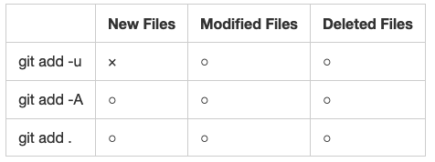

# This document explains about git architecture and git usage. 

[a documentation about markdon writing is here](./markdown.md)


## The first thing. 
**git and github is totally different thing.**   
The main architecture used in github is git.   
git is one of the version control system,  
created by *Linus Torvalds* (also the founder of Linux).  

In this document, git architecture and git usage is   
simply explaind. 

## The initial bash setting

Before starting git, it is good for you 
to add the code below to your *~/.bash_profile*  

Basic bash setting. 
```
if [ -f ~/.bashrc ]; then   
        . ~/.bashrc   
fi    

export GIT_EDITOR=vim  

export LC_ALL=en_US.UTF-8  
export LC_ALL=ja_JP.UTF-8  
```

Git branch in prompt (useful)   

* * *
parse_git_branch() {   
  git branch 2> /dev/null | sed -e '/^[^*]/d' -e 's/* \(.*\)/ (\1)/'   
}  
export PS1="\u \W\[\033[32m\]\$(parse_git_branch)\[\033[00m\] $ "  

* * * 


## the initial git setting
*Be careful, this is different from github initial setting.*   

`git init` creates *.git* directory, and initialize git. 


```
git init
git add .
git commit 
```


# Check Commits.  
See the history of commits.  
```
git log
``` 

See the detail record of a commit.  
```
git show <SHA1 hash>
```

See the simple record of commits according to each branch.  
```
git show-branch --more=10
```


# Kinds of Git Objects. 

- blob   
Stands for _binary large object_.  
Git does not use file name, but use SHA1 hash generated  
with binary code of each file.  

- tree  
Express one directory information.  

- commit  
Metadata for each change to a repository.  

- tag  
Alias for commit.  

# Git Architecture. 

  

* * *  
  

* * *  
  


# Grouping of Files within Git.  

- tracked.  
Files which are already in repository, or are indexed.  

- ignored.  
Files which explicitly declared as ignore.  

- untracked.   
Files belonging to neither of tracked or ignored.  

## The way of checking tracked, ignored and untracked.  

*Example case.* 
(start with clean status, which means all files are tracked or ignored.)  
This example creates tracked, ignored and untracked file.  
(and if you already have .gitignore file, you can also see changes files,  
which are also one of the untracked files. )   
```
echo "dirty file" > dirty1.txt
echo "dirty file" > dirty2.txt 
echo " dirty file" > dirty3.txt 
echo dirty3.txt > .gitignore  
git add dirty1.txt 

git status
```

- Note.   
If .gitignore is not sharing with other branches,  
This makes problem if you checkout another branch.  
That file remains and in another branch, treated as a untracked file.  

## git add options.  
See the picture below.  
`git add .` adds only files under a current directory.  
  


# Commit Names.  

- reference (ref)  
SHA1 hash ID pointing at the object within a object strage.  

- symbolic reference (symref)  
Indirect reference name.  

## default symbolic reference  

- HEAD   
Symref for the newest commit in the current branch.  

- ORIG\_HEAD   
Previous HEAD.  

- FETCH\_HEAD  
If you fetch a remote repository, the head commit of the branch is   
registered in the FETCH\_HEAD   

- MERGE\_HEAD   
A commit that will be merged to HEAD.   

## Relative Commit Name.  
Examples.  

- master^ = master~  
The second newest commit in the master branch.  

- master~2    
The third newest commit in the master branch.  

## Summary Picture of commit names.  

  

## History of Commits.  
Useful options.   
```
git log --pretty[=oneline|short|full] --abbrev-commit --stat` 
```

_pretty_ means amount of output.  
_abbrev_ means abbreviation of commit ID.  
_stat_ means list edited files and summarize edited lines for each file.  

*Examples.*  
```
git log HEAD~10.. --pretty=oneline --abbrev-commit  
(same as git log HEAD~10..HEAD --pretty=oneline --abbrev-commit)
```

```
git log HEAD~2.. --stat
```

cf.   
```
git show HEAD~2..
```

```
git log -1 -p HEAD~3
(same as git log -1 -p master HEAD^3
```

_-p_ means difference, and -1 is # of output. 


## Visualize Commit Graph.  
1. `gitk`  
The graph exists in the left top of the window.  

2. git log with simple options  
```
git log --graph --pretty=oneline --abbrev-commit 
```

3. git log with complicated options  

```
git log --graph --abbrev-commit --decorate --format=format:'%C(bold blue)%h%C(reset) - %C(bold green)(%ar)%C(reset) %C(white)%s%C(reset) %C(dim white)- %an%C(reset)%C(bold yellow)%d%C(reset)' --all
```
or   
```
git log --graph --abbrev-commit --decorate --format=format:'%C(bold blue)%h%C(reset) - %C(bold cyan)%aD%C(reset) %C(bold green)(%ar)%C(reset)%C(bold yellow)%d%C(reset)%n''          %C(white)%s%C(reset) %C(dim white)- %an%C(reset)' --all
```

from this post. https://stackoverflow.com/questions/1057564/pretty-git-branch-graphs  

etc...  
-gitg  
-GitGraph.js (https://qiita.com/uzuki\_aoba/items/76e59f65cb50ef020e3c)  
-gitdags  

# git diff Command.  

- `git diff`  
Show difference between working directory and index.  
It means telling me differences to be indexed.  

- `git diff _commit_`  
Show difference between working directory and commit.  
Frequent usage may be `git diff HEAD`.  

- `git diff --cached _commit_`  
Show difference between index and commit.  
Frequent usage may be `git diff --cached HEAD` or `git diff --cached`.  


# Merge 
git's main troublesome things will be "merge". 
Then, this chapter, we will explore how to solve conflicts elegantly. 

## Make conflicts. 
```
git init 
echo "hello world" > text.txt
git add .
git commit 

git branch test 

echo "dirty line" >> text.txt 
git add .
git commit 

git checkout test 
echo "hello2 world" >> text.txt 
git add .
git commit 

git merge master 
```

##  Find Out Coflicted Files. 

`git status`  or `git ls-files -u` is good.  

Also if you want to find out differences between files,  

```
git diff  
git diff MERGE\_HEAD  
git diff --stat
```
 
are options.   

If you want to find out commits that cause the conflicts, use the code below.  
```
git log --merge --left-right -p  
git log --merge --left-right -p <filename>
```

*Q. if you want to adopt whole changes of one branch, how?*  
A. 
If you want to adopt branch which you are now checking out, use --ours,
els use --theirs.

This code is for each file. 
```
git checkout --[ours|theirs] <filename>
```
This code should be used after reset merge, 
```
git merge -X[ours|theirs] <branchname>
```

*Q. if you want to cancel merge, how?*  
A. 
```
git reset --hard HEAD
```
After you merge, and want to reset merge, 
```
git reset --hard ORIG_HEAD
```

Be careful, if you start merge in the dirty directory, 
your untracked files are lost completely. 

# Pick up commit from the history. 

`git cherry-pick` is recommit to the branch.  
`git revert` is reverse commit to the branch. `git revert` can be used for cancel the commit.  


# Merge remote repository 

## Routine Work.

If you share work in remote repository, 
it is simplest (maybe not best) wasy to update your working.

```
git pull origin master   

__edit_files__
git add .
git commit -m "some comment" 

git push origin master 
```


## Case 1. 
You clone origin repository at the time of B.    
You write some program and commit twice ( X and Y ).  
Also, origin repository is edited by some other person ( C and D).    

How you can update your change into origin repository?   

   


`git fetch` (the first process of `git pull`) allows you 
to fetch repository history from origin, 
and save this into origin/master branch. 

Then, the answer is, 
```
git fetch origin master
git merge origin/master
```
or 
```
git pull origin master 
```
and after your resolve conflicts ( if exists),   
type the code below.   
```
git push origin master
```
Then you can update origin repository.  


# GitHub Flow.  
This is one example of usage of github.  

- Anything in the master branch is deployable
- To work on something new, create a descriptively named branch off of master (ie: new-oauth2-scopes)
- Commit to that branch locally and regularly push your work to the same named branch on the server
- When you need feedback or help, or you think the branch is ready for merging, open a pull request
- After someone else has reviewed and signed off on the feature, you can merge it into master
- Once it is merged and pushed to ‘master’, you can and should deploy immediately

See the detail, https://gist.github.com/Gab-km/3705015


# Managing Branch. 
This picture is one good management style, cited from 
[A successful Git branching model](https://nvie.com/posts/a-successful-git-branching-model/).<br> 
A part of this document is old, but many are still useful.  

* * *
  

* * * 

# Q and A. 

*Q. How to make new branch from old commit?*  
A.  
```
git checkout <SHA1 hash> 
```
The branch is changed to *detached HEAD*.  
```
git branch <branchname>
git checkout <branchname>
```
Then, you can work from the specific commit status. 


* * * 

# Garbage Zone, You do not need to read the contents below.
## To Do List.  
- If you work in the wrong branch, and want to reflect changes to another branch, how?   
- How to control data withing local environment only?   
- How to manage jupyter notebook code efficiently?  

## Make Test Environment.  

Delete files other than ones of which prefix is "." .  
``` 
ls | xargs rm -r
```

Make test files.  
```
echo "hello world" >> hoge1.txt
echo "my name" >> hoge2.txt 
```

- Linuxで特定のファイル、ディレクトリ以外を削除するコマンド  
https://ameblo.jp/pori-memo/entry-12063386035.html  


## Our GitHub Flow.  
Due to reaons below, we have to change the style of GitHub Flow.  

- we do not think deploy.  
- we do not develop large code, usually tasks are completed within individuals.  

Then, 
- Anything in the master branch can be run. 
- Master branch is sharing place, use pullrequest to master when you finish some tasks. 
- Branch is made for individuals scale  
- If you want to edit the branch created by others,   
Make a branch from that branch, edit files, and send a pull request. 


